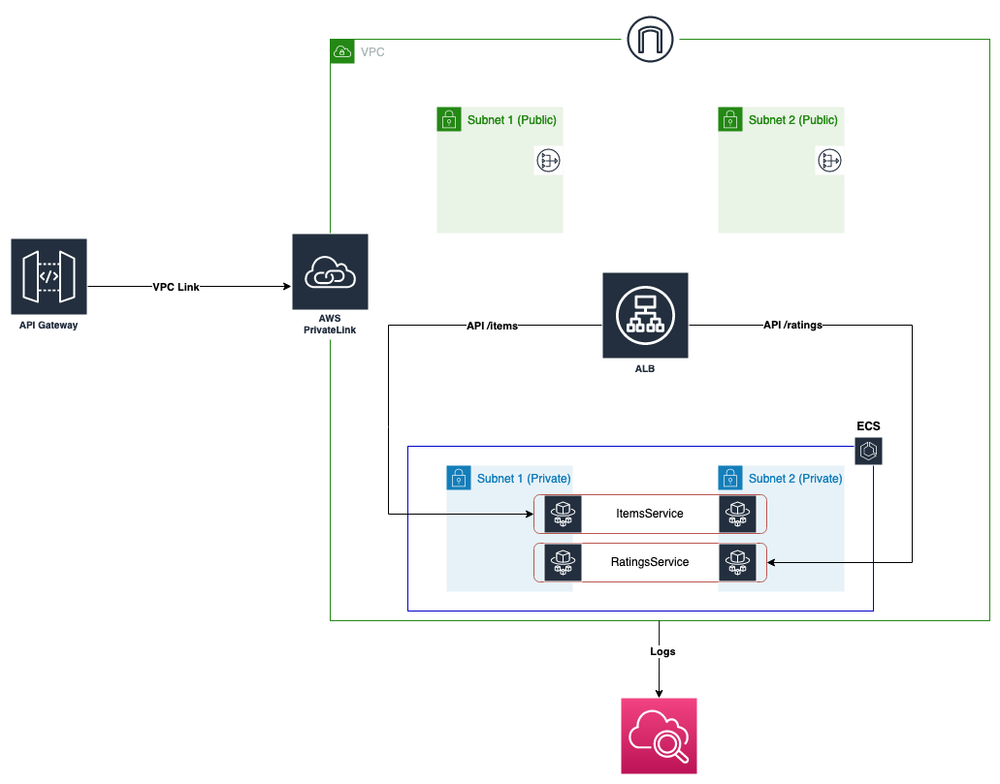

# Fargate Example

### What is this application about ?
* An example to setup microservices using fargate. We are going to setup two microservices: 
  * ItemsService: A simple Express.js based microservice that hosts a list of items.
  * RatingsService: A simple Express.js based microservice that hosts ratings for the items.


### What are we deploying ?


Broadly:
* Two NodeJs microservices using AWS Fargate within a VPC we define.
* An application load balancer.
* AWS API Gateway integration backed by AWS Private Link.

_Note: I have deployed this application to `us-west-2` region. As such, the readme lists example outputs and commands for `us-west-2`. If you would like to deploy this to any other region, alter the commands appropriately, update and replace code references from `us-west-2` to your desired region._


### Instructions

#### Pre-Requisites (OPTIONAL)
* You have your favorite IDE installed for exploring code. ([IntelliJ](https://www.jetbrains.com/idea/) or [VSCode](https://code.visualstudio.com))
* You have node and npm installed. I highly encourage using [nvm](https://github.com/nvm-sh/nvm) for easy management of node versions. 
* You have installed and configured `aws-cdk`. If not you can find the configuration instructions [here](https://docs.aws.amazon.com/cdk/v2/guide/getting_started.html).
* You have installed and configured `aws-cli`. If not you can find the instructions [here](https://docs.aws.amazon.com/cli/latest/userguide/getting-started-install.html)
* You have [docker](https://www.docker.com) installed, up and running.


#### Build Docker Images

##### Building Docker Image For Items Service.
* Follow readme instructions [on ItemsService repository](https://github.com/JoeNonExotic/ItemsService)

##### Building Docker Image For Ratings Service.
* Follow readme instructions [on RatingsService repository](https://github.com/JoeNonExotic/RatingsService)

#### Setup ECR
* Login to ECR
```bash
aws ecr get-login-password --region <your_aws-region> | docker login  --username AWS   --password-stdin <aws_acc_id>.dkr.ecr.us-west-2.amazonaws.com
```
* If login was successful:
```
Login Succeeded
```

* Create `items-service` ECR repository
```bash
aws ecr create-repository \
            --repository-name items-service \
            --image-scanning-configuration scanOnPush=false \
            --region us-west-2
```
* Your output should look like as follows: 
```json
{
    "repository": {
        "repositoryArn": "arn:aws:ecr:us-west-2:<aws_acc_id>:repository/items-service1",
        "registryId": "<aws_acc_id>",
        "repositoryName": "items-service",
        "repositoryUri": "<aws_acc_id>.dkr.ecr.us-west-2.amazonaws.com/items-service1",
        "createdAt": "<ISO Timestamp>",
        "imageTagMutability": "MUTABLE",
        "imageScanningConfiguration": {
            "scanOnPush": false
        },
        "encryptionConfiguration": {
            "encryptionType": "AES256"
        }
    }
}
```


* Create `ratings-service` ECR repository
```bash
aws ecr create-repository \
            --repository-name ratings-service \
            --image-scanning-configuration scanOnPush=false \
            --region us-west-2
```
* Your output should look like as follows:
```json
{
    "repository": {
        "repositoryArn": "arn:aws:ecr:us-west-2:<aws_acc_id>:repository/ratings-service",
        "registryId": "<aws_acc_id>",
        "repositoryName": "ratings-service",
        "repositoryUri": "<aws_acc_id>.dkr.ecr.us-west-2.amazonaws.com/ratings-service",
        "createdAt": "ISO Timestamp",
        "imageTagMutability": "MUTABLE",
        "imageScanningConfiguration": {
            "scanOnPush": false
        },
        "encryptionConfiguration": {
            "encryptionType": "AES256"
        }
    }
}
```

#### Push Docker Images To ECR
* Verify your images are listed in docker: 
```
docker images
```

* Push items-service image to ECR: 
```
docker push <aws_acc_id>.dkr.ecr.us-west2.amazonaws.com/items-service
```

* Push ratings-service image to ECR: 
```
docker push <aws_acc_id>.dkr.ecr.us-west-2.amazonaws.com/ratings-service
```

#### Deploy Your Application! 
_Every time you make changes to your images or the infrastructure, you would want to run the following steps_
1. `npm run build`
2. `cdk bootstrap` (required only once)
3. `cdk synth`
4. `cdk deploy --all`

#### Your Deployment Should Complete With Output Similar To Below:
```
ApiGatewayStack.EC2publicipaddress = x.x.x.x
ApiGatewayStack.HTTPAPIendpoint = https://xxxxxxxxxx.execute-api.us-west-2.amazonaws.com
ApiGatewayStack.ItemsService = https://xxxxxxxxxx.execute-api.us-west-2.amazonaws.com/api/items
ApiGatewayStack.RatingsService = https://xxxxxxxxxx.execute-api.us-west-2.amazonaws.com/api/ratings
Stack ARN:
arn:aws:cloudformation:us-west-2:<aws_acc_id>:stack/ApiGatewayStack/<uuid>
```

### Testing Your Application
* You can access items and ratings services at the following: 
  * https://xxxxxxxxxx.execute-api.us-west-2.amazonaws.com/api/items
  * https://xxxxxxxxxx.execute-api.us-west-2.amazonaws.com/api/ratings

### To-Do
- [ ] Update readme with dir structure and references
- [ ] Update architecture diagram